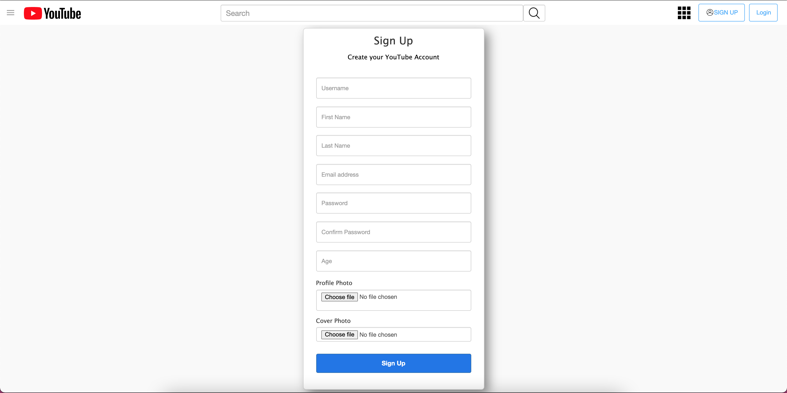

# Django Youtube Clone

This is a simple youtube clone project. In this app a user can: \
       •› sign up \
       •› make their profile \
       •› upload videos \
       •› watch videos \
       •› like \
       •› comment \
       •› subscribe

Version of python 3.9.7, mysql 8.0.28

## Screenshots
### Home Page

\
\
### Sign Up

\
\
### Log In

\
\
### Upload Videos

\
\
### Video Player, Like, Subscribe

\
\
### Add Comments

\
\
### History

\
\
### Liked Videos

\
\
### Channels

